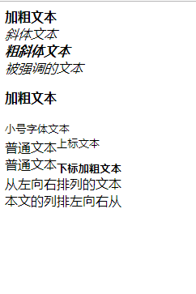
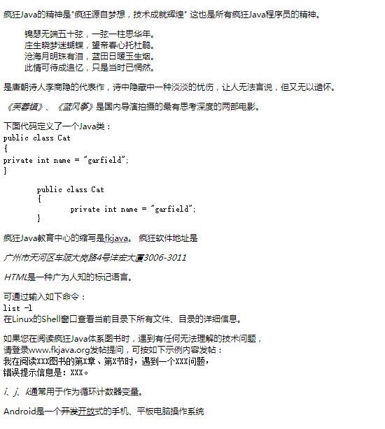
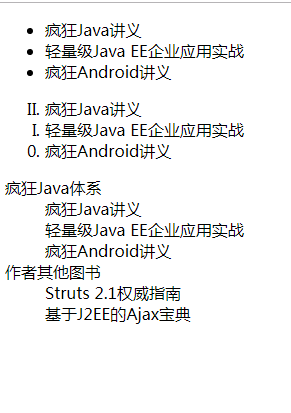
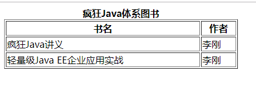
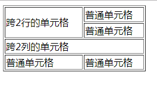
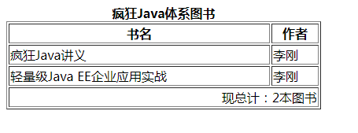
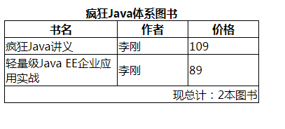

# 1. 第2章 HTML 5 的常用元素与属性

## 1.1. HTML 5 保留的常用元素

### 1.1.1. HTML 5 保留的基本元素
* `<!--...-->`：注释。
* `<html>`：根元素。
* `<head>`：页面头部内容。
* `<title>`：页面标题。
* `<body>`：页面主体，该标签可以指定id、class、style等核心属性，还可以指定onload、onunload、ondblclick、onmousedown、onmouseup、onmouseover、onmousemove、onmouseout、onkeypress、onkeydown、onkeyup等事件属性。
* `<style>`：引入样式。
* `<h1>到<h6>`：标题一到标题六，块级元素。
* `<p>`：段落，块级元素。
* `<br>`：换行。
* `<hr>`：水平线。
* `<div>`：文档中的节，块级元素。
* `<span>`：与`<div>`类似，行内元素。
几乎所有的HTML元素都可以指定id、class和style属性，id属性用于为HTML元素指定唯一的标识，该标识是通过DOM访问HTML元素的重要途径。class和style属性是CSS样式相关的属性。`<span.../>`和`<p.../>`元素智能保护文本、图像、超链接、文本格式化元素和表单控件等元素内容。</br>

程序清单：[codes\02\2.1\basic.html](https://github.com/The-Emperor1/fk-html-css-javascript/blob/master/codes/02/2.1/basic.html)</br>
页面效果：
<br>
<div align="center">
    
</div>
<br>

### 1.1.2. 文本格式化元素
* `<b>`：粗体文本。
* `<i>`：斜体文本。
* `<em>`：强调文本。
* `<strong>`：粗体文本。
* `<small>`：消耗字体文本。
* `<sup>`：上标文本。
* `<sub>`：下标文本。
* `<bdo>`：文本显示方向，通过指定dir属性，属性值为ltr时，从左到右排列，属性值为rtl时，从右到左排列。

程序清单：[codes\02\2.1\text.html](https://github.com/The-Emperor1/fk-html-css-javascript/blob/master/codes/02/2.1/text.html)</br>
页面效果：
<br>
<div>
    
</div>
<br>

### 1.1.3. 语义相关的元素
* `<abbr>`：用于表示一个缩写。
* `<address>`：用于表示一个地址。
* `<blockquote>`：定义一段长的引用文本。
* `<q>`：定义一段短的引用文本。
* `<cite>`：用于表示作品（书、电影、歌曲）的标题，斜体展示。
* `<code>`：计算机代码。
* `<dfn>`：专业术语。
* `<del>`：被删除的文本。
* `<ins>`：文档中插入的文本。
* `<pre>`：表示该元素包含的文本已经进行了“预格式化”。
* `<samp>`：定义示范文本内容。
* `<kbd>`：定义键盘文本。
* `<var>`：变量。

程序清单：[codes\02\2.1\semantic.html](https://github.com/The-Emperor1/fk-html-css-javascript/blob/master/codes/02/2.1/semantic.html)</br>
页面效果：
<br>
<div>
    
</div>
<br>

### 1.1.4. 超链接和锚点
HTML页面通过超链接与网络上的其他资源进行关联，HTML 5 保留了定义超链接的`<a.../>`元素，其可以包含文本、图像、各种文本格式化元素和表单元素等内容。`<a.../>`元素具有以下三个重要属性：
* href：指定超链接关联的资源，既可以是绝对路径，也可以是相对路径。
* target：指定使用框架集中的哪个框架来装载另一个资源，属性值可以为_self、_blank、_top和_parent，分别代表自身、新窗口、顶层框架和父框架。
* media：HTML 5 新增的属性，指定目标URL所引用的媒体类型。默认值为all，只有指定了href属性值时该属性才生效。

程序清单：[codes\02\2.1\anchor.html](https://github.com/The-Emperor1/fk-html-css-javascript/blob/master/codes/02/2.1/anchor.html)</br>
当href为绝对路径时，href属性值为URL(Uniform Resource Locator，统一资源定位器)，URL用于对互联网上的资源进行寻址，一个完整的网址，遵守如下语法规则：
```
scheme://host.domain:port/path/filename
```
* scheme：指定因特网服务的类型，例如：HTTP、HTTPS。
* host：指定此域中的主机。如果省略，HTTP的默认主机是www。
* domain：指定因特网域名，例如：baidu.com，baidu.org。
* port：指定主机的端口号，可以被省略，HTTP的默认端口号是80。
* path：指定远程服务器上的路径，可以被省略，默认定位到根目录。
* filename：指定远程文档的名称，可以被省略，默认定位到index.html。

除此之外，`<a.../>`元素还可以生成一个命名锚点。
首先插入定位锚点需要指定name属性，name属性值就是该命名锚点的名称：
```
<a name='test'></a>
```
用浏览器浏览命名锚点时，该命名锚点不会生成任何显示内容，可以通过超链接来定位到该锚点：
```
<a href=anchor.html#test>定位到test锚点</a>
```

### 1.1.5. 列表相关元素
* `<ul>`：无序列表，该元素只能包含<li.../>子元素。
* `<ol>`：有序列表，该元素只能包含<li.../>子元素。此外，该元素还可以指定如下属性：
  * start：列表项的起始数字，默认是第一个，例如：1、A等。
  * type：编号类型，1代表数字，A和a代表使用字母，I和i代表使用罗马数字。
* `<li>`：列表项。
* `<dl>`：列表，该元素只能包含<dt.../>和<dd.../>子元素
* `<dt>`：标题列表项。
* `<dd>`：普通列表项。

程序清单：[codes\02\2.1\list.html](https://github.com/The-Emperor1/fk-html-css-javascript/blob/master/codes/02/2.1/list.html)</br>
页面效果：
<br>
<div>
    
</div>
<br>

### 1.1.6. 图像相关元素
HTML 5 保留了``元素在页面中定义图片，这个元素只能是一个空元素，它不可以包含任何内容。必须为其指定以下两个属性：
* src：图片位置。
* alt：图片提示信息。
此外，还可以指定如下属性：
* width：图片宽度。
* height：图片高度。
此外，与图片相关的还有如下两个标签：
* `<map>`：用于定义图片的映射。该元素主要可以包含一个或多个<area.../>子元素，每个<area.../>定义一个区域，不同区域可以链接到不同的URL。
* `<area>`：用于定于图片映射的内部区域，其属性值包括：
    * shape：指定该内部区域是哪种区域，默认值为“rect”,即矩形区域，还可以为circle和ploy。
    * coords：指定多个坐标值，用于确定区域位置。
    * href：用于指定该区域链接的资源。
    * alt：提示信息
    * target：指定使用框架集中的哪个框架来装载另一个资源，属性值可以为_self、_blank、_top和_parent，分别代表自身、新窗口、顶层框架和父框架。
    * media：HTML 5 新增的属性，指定目标URL所引用的媒体类型。默认值为all，只有指定了href属性值时该属性才生效。

程序清单：[codes\02\2.1\img.html](https://github.com/The-Emperor1/fk-html-css-javascript/blob/master/codes/02/2.1/img.html)</br>

### 1.1.7. 表格相关元素
* `<table>`：用于定义表格，<table.../>元素只能包含0个或1个<caption../>子元素(定义表格标题)，0个或1个<thead../>子元素(定义表格头)，0个或1个<tfoot../>子元素(定义表格脚)，若干个<tr../>子元素(定义表格行)，若干个<tbody../>子元素(定义表格体)，还可以指定如下属性：
    * cellpadding：指定单元格内容和单元格边框之间的间隔。
    * cellspacing：指定单元格之间的间隔。
    * width：指定表格宽度。
* `<caption>`：定义表格标题，该元素只能包含文本、图片、超链接、文本格式化元素和表单控件。
* `<tr>`：定义表格行，该元素只能包含<td.../>或者<th.../>两种元素。
* `<td>`：定义单元格，可以为该元素指定如下几个属性：
    * colspan：指定单元格跨越多少列。
    * rowspan：指定单元格跨越多少行。
    * height和width：指定单元格高度和宽度。
* `<th>`：定义表格页眉的单元格，和<td.../>标签的用法几乎完全一样。
* `<tbody>`：定义表格的主体，该元素只能包含<tr.../>子元素。
* `<thead>`：定义表格头，和<tbody.../>标签的用法相似。
* `<tfoot>`：定义表格脚，和<tbody.../>标签的用法相似。

程序清单：[codes\02\2.1\simpleTable.html](https://github.com/The-Emperor1/fk-html-css-javascript/blob/master/codes/02/2.1/simpleTable.html)</br>
页面效果：
<br>
<div>
    
</div>
<br>

程序清单：[codes\02\2.1\tablespan.html](https://github.com/The-Emperor1/fk-html-css-javascript/blob/master/codes/02/2.1/tablespan.html)</br>
页面效果：
<br>
<div>
    
</div>
<br>

程序清单：[codes\02\2.1\tablewithbody.html](https://github.com/The-Emperor1/fk-html-css-javascript/blob/master/codes/02/2.1/tablewithbody.html)</br>
页面效果：
<br>
<div>
    
</div>
<br>

此外，HTML 5 还保留了两个标签用于在页面中为某列指定属性：
* `<col>`：用于为表格中的一个或多个列指定属性值，该元素只能出现在<table.../>或<colgroup.../>元素内，可以为该元素指定一下属性：
    * span：跨越多少列。
* `<colgroup>`：该元素用于为表格中的一个或多个列指定属性值，该元素只能出现在<table.../>或<colgroup.../>元素内。其作用只是用于组织多个<col.../>元素。

程序清单：[codes\02\2.1\tablewithcol.html](https://github.com/The-Emperor1/fk-html-css-javascript/blob/master/codes/02/2.1/tablewithcol.html)</br>
页面效果：
<br>
<div>
    
</div>
<br>

### 1.1.8. 框架相关元素
HTML 5 不再推荐在页面中使用框架集，因此HTML 5 删除了<frameset.../>、<frame.../>和<noframes.../>这3个标签。但HTML 5 保留了<iframe.../>元素，该元素用于在一个普通HTML 页面中生成一个内联框架，可以为该元素指定如下属性：
* src：指定一个URL，指定该iframe将装载哪个页面。

## 1.2. HTML 5 新增的通用属性