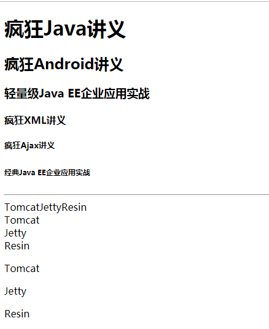

# 1. 第2章 HTML 5 的常用元素与属性

## 1.1. HTML 5 保留的常用元素

### 1.1.1. HTML 5 保留的基本元素
* `<!--...-->`：注释。
* `<html>`：根元素。
* `<head>`：页面头部内容。
* `<title>`：页面标题。
* `<body>`：页面主体，该标签可以指定id、class、style等核心属性，还可以指定onload、onunload、ondblclick、onmousedown、onmouseup、onmouseover、onmousemove、onmouseout、onkeypress、onkeydown、onkeyup等事件属性。
* `<style>`：引入样式。
* `<h1>到<h6>`：标题一到标题六，块级元素。
* `
`：段落，块级元素。
* ` `：换行。
* `
`：水平线。
* `
`：文档中的节，块级元素。
* ``：与`
`类似，行内元素。
几乎所有的HTML元素都可以指定id、class和style属性，id属性用于为HTML元素指定唯一的标识，该标识是通过DOM访问HTML元素的重要途径。class和style属性是CSS样式相关的属性。`<span.../>`和`<p.../>`元素智能保护文本、图像、超链接、文本格式化元素和表单控件等元素内容。 
程序清单：[codes\02\2.1\basic.html](https://github.com/The-Emperor1/fk-html-css-javascript/blob/master/codes/02/2.1/basic.html) 
页面效果：
 

    

 

### 1.1.2. 文本格式化元素
* `<b>`：粗体文本。
* `<i>`：斜体文本。
* `<em>`：强调文本。
* `<strong>`：粗体文本。
* `<small>`：消耗字体文本。
* ``：上标文本。
* ``：下标文本。
* `<bdo>`：文本显示方向，通过指定dir属性，属性值为ltr时，从左到右排列，属性值为rtl时，从右到左排列。
